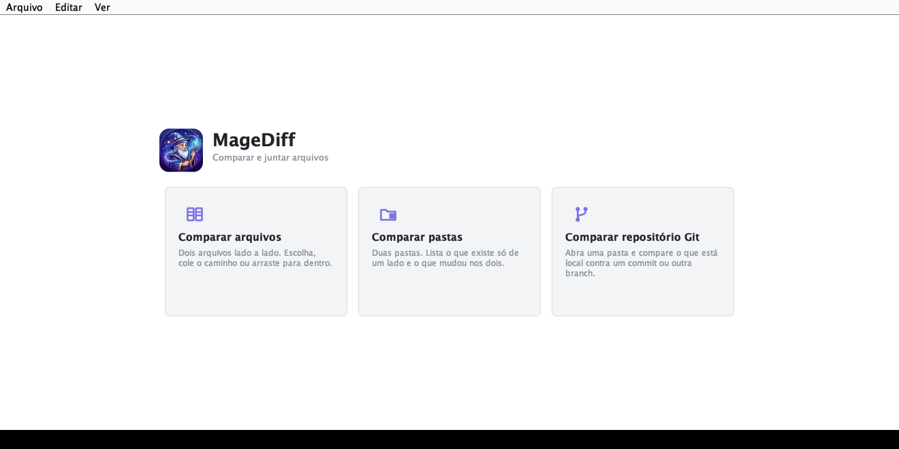
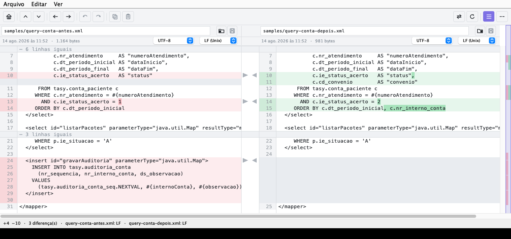
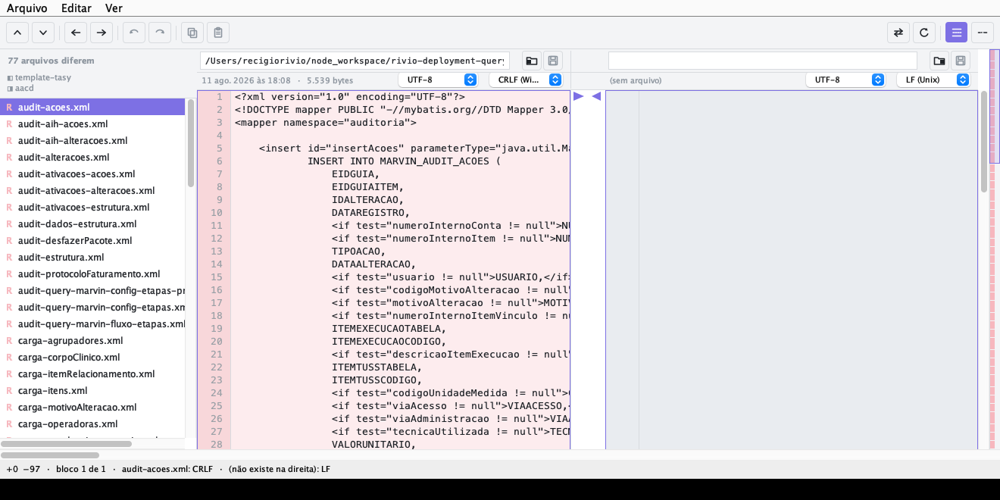
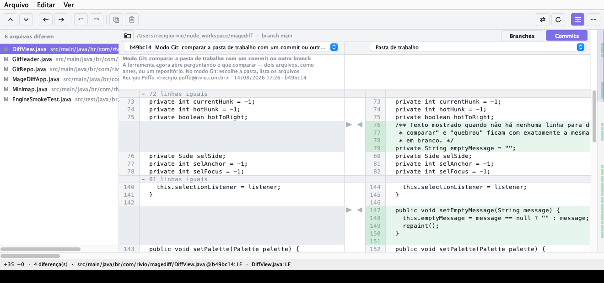
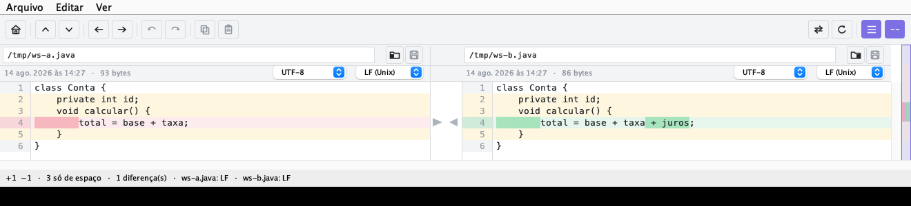

# MageDiff

Comparador e merge de dois arquivos, no espírito do Beyond Compare: diff lado a
lado com realce do que mudou **dentro** da linha, e setas na coluna do meio para
mandar um bloco de um lado para o outro. Arraste arquivos, edite caminho,
codificação e fim de linha, desfaça no ponto onde a cópia caiu.

Java 17 + Swing. O alinhamento vem do **HistogramDiff do [Eclipse JGit](https://www.eclipse.org/jgit/)**
— o mesmo motor de diff que uma implementação real do Git usa. As dependências
são resolvidas uma vez para `target/lib`; depois disso `./run.sh` só usa
`javac`/`java`.





## Dois modos

Ao abrir sem argumentos, o MageDiff pergunta o que você quer comparar:

| Modo | O que faz |
|---|---|
| **Comparar arquivos** | dois arquivos lado a lado — escolher, colar o caminho ou arrastar |
| **Comparar pastas** | duas pastas: lista o que existe só de um lado e o que mudou nos dois, casando pelo caminho relativo. Aqui os **dois** lados são graváveis |
| **Comparar repositório Git** | abre uma pasta e compara por **branch** ou por **commit**. Lista os arquivos que diferem; clicar num deles abre o diff |

No modo Git há duas listas, alternadas pelo botão **Branches / Commits**:
branch responde "como está na main?" e commit responde "o que mudou naquele
commit de terça?". Com um commit escolhido, um quadro abaixo mostra a mensagem
(resumo e corpo), autor, e-mail, data e hash — a mensagem inteira fica na dica de
contexto. A pasta de trabalho aparece nas duas listas, porque comparar com ela é
o caso mais comum dos dois lados.

**Comparação grande não congela a janela.** Varrer duas pastas ou um repositório
roda fora da thread da interface, com uma tela de espera que só aparece se a conta
passar de 150 ms — assim ela não pisca a cada troca de arquivo pequeno.

**Fechar a comparação (o botão 🏠 ou `⌘W`) volta à tela inicial**, limpando arquivos,
repositório, histórico e seleção — reencontrar o desfazer da comparação anterior
aplicaria uma alteração que pertence a outro par de arquivos. Na própria tela
inicial, `⌘W` fecha a janela.





No modo Git o lado da revisão é **somente leitura** — commit é imutável, então
não há onde gravar. Copiar um bloco para esse lado é bloqueado com aviso, em vez
de alterar só a memória e sumir no clique seguinte. O lado da pasta de trabalho
grava normalmente.

O JGit já estava no projeto pelo algoritmo de diff, e ele é uma implementação
completa do Git: ler branches, árvores e blobs não depende do executável `git`
estar instalado.

## Rodar

```bash
./run.sh                          # tela inicial: escolher arquivos ou repositório
./run.sh --git /caminho/do/repo   # abre direto no modo Git
./run.sh --folders pastaA pastaB  # abre direto comparando duas pastas
./run.sh a.xml b.xml              # já abre comparando
./run.sh demo                     # abre os arquivos de samples/ em cópia
./run.sh test                     # verificações do motor de diff e do merge
./run.sh render a.xml b.xml o.png # PNG da área de diff, sem abrir janela
```

Ou pelo Maven, se quiser o jar: `mvn package` →
`java -jar target/magediff-1.0.0.jar a.xml b.xml` (3,5 MB, autocontido).

**Aplicativo nativo:** `./package-app.sh` gera `target/app/MageDiff.app`
(56 MB), que abre com duplo clique e **embute o runtime Java** — a máquina de
destino não precisa ter Java. `./package-app.sh dmg` gera o instalador.

No IntelliJ há dois run configs no projeto do workspace: **magediff**
(abre a janela) e **magediff (testes)**. Eles precisam do módulo
importado — se o IDEA ainda não conhece este projeto, clique com o botão direito
em `pom.xml` → *Add as Maven Project*.

## Usar

| Ação | Como |
|---|---|
| Próxima diferença / anterior | `F8` / `F7` — ou `⌘↓` / `⌘↑`, ou os botões |
| Copiar o bloco para a direita | seta `▶` na coluna do meio, `⌥→`, ou "Copiar →" |
| Copiar o bloco para a esquerda | seta `◀`, `⌥←`, ou "← Copiar" |
| Escolher o bloco sem copiar | clicar em qualquer linha dele |
| Selecionar linhas | clicar numa linha; arrastar ou `Shift`+clique para estender |
| Copiar linhas para a área de transferência | `⌘C` |
| Colar por cima da seleção | `⌘V` |
| Desfazer / refazer | `⌘Z` / `⌘⇧Z` (ou `⌘Y`) — ou o **↶ que aparece na coluna do meio**, onde a cópia acabou de cair |
| Voltar à tela inicial | menu Arquivo › Tela inicial (`⌘0`) |
| Abrir repositório Git | menu Arquivo › Comparar repositório Git (`⌘G`) |
| Escolher arquivo | **arrastar do Finder** para o lado desejado, pastinha na barra de caminho, ou colar o caminho e teclar Enter |
| Gravar um lado | disquete ao lado da pasta, ou o menu Arquivo |
| Trocar codificação / fim de linha | combos na segunda fileira do cabeçalho |
| Limpar a seleção | `Esc` |
| Ver o arquivo inteiro | desligar "Só mudanças" |
| Ignorar diferença só de indentação | ligar "Ignorar espaços" |
| Saltar para um ponto do arquivo | clicar no mapa da direita |
| Trocar os lados | botão `⇄` |
| Reler do disco | "Recarregar" ou `F5` (relista pastas/repositório também) |
| Ajustar a largura de cada lado | arrastar o espaço vazio da coluna do meio; duplo clique volta ao meio a meio |
| Comparar pastas / repositório | menu Arquivo (`⌘D` / `⌘G`) |
| Gravar | menu Arquivo › Salvar esquerda `⌘S` / direita `⇧⌘S` (só habilitam com alteração pendente) |

Fora do macOS, troque `⌘` por `Ctrl`. `⌘↑`/`⌘↓` existem porque o macOS captura
`F7`/`F8` para as teclas de mídia quando "usar F1, F2 como teclas de função"
está desligado — que é o padrão.

A barra de ferramentas é de ícones (passe o mouse para a dica com o atalho) e o
caminho de cada arquivo fica no topo da coluna correspondente, editável. **Os
nomes das ações e os atalhos estão nos menus** Arquivo / Editar / Ver — com a
barra só de ícones, é o menu que diz o que o app faz.

| Menu | Itens |
|---|---|
| Arquivo | Nova comparação `⌘N` · Abrir esquerda `⌘O` / direita `⇧⌘O` · Recarregar `F5` · Salvar esquerda `⌘S` / direita `⇧⌘S` · Fechar `⌘W` |
| Editar | Desfazer `⌘Z` · Refazer `⇧⌘Z` · Copiar linhas `⌘C` · Colar `⌘V` · Copiar bloco `⌥→` / `⌥←` |
| Ver | Próxima `F8` / anterior `F7` diferença · Só mudanças · Ignorar espaços · Trocar lados |

Gravar mora no menu e não na barra: como ícone, "seta para uma base" é a
convenção de **download**, e era exatamente assim que os dois botões eram lidos.
Salvar um lado que veio de "Nova comparação" abre o seletor de destino.

**Rastro da cópia, com ponto de volta:** depois de copiar um bloco, ele deixa de
ser diferença — os dois lados ficaram iguais. O trecho fica marcado com uma
faixa e **não é escondido** pelo "só mudanças", e no começo dele aparece um ↶
clicável que desfaz aquela cópia. Sem isso, o trecho mesclado viraria contexto
igual a qualquer outro e sumiria no meio do arquivo, junto com o desfazer —
justamente no momento em que você mais quer saber onde ele estava.

O bloco atual fica contornado e a seleção de linhas ganha um véu translúcido (as
cores de adicionado/removido continuam visíveis por baixo). Depois de copiar, o
foco cai no bloco seguinte — dá para resolver o arquivo inteiro repetindo `⌥→`.

**Colar em seleção vazia insere.** Se você seleciona, pela esquerda, um trecho
que só existe na direita, o intervalo daquele lado é vazio: colar ali insere no
ponto em vez de substituir. É o mesmo intervalo semiaberto que as setas usam.

## O que ele faz questão de acertar

**Não estraga o arquivo ao salvar.** Fim de linha (LF/CRLF), BOM e ausência de
quebra final são detectados na leitura e reescritos como estavam. Uma ferramenta
que "conserta" isso sozinha transforma um merge de uma linha em 400 linhas
alteradas no diff do git. A única exceção é arquivo com EOL **misto**: aí a
gravação uniformiza para o majoritário, e a barra de status avisa antes.

**Diferença que o diff por linha não mostra, ele diz por escrito.** Se as linhas
são idênticas e a diferença é só o EOL, o BOM ou a quebra final, a barra de
status escreve isso — senão a tela pareceria dizer "arquivos iguais" enquanto os
bytes diferem.

**O realce aponta a mudança, não a linha.** Comparação por token com pontuação
isolada: uma linha que só ganhou uma vírgula marca a vírgula, não o pedaço todo.

**Copiar cobre inserir e apagar.** O bloco é um intervalo semiaberto dos dois
lados, então "deixar a direita igual à esquerda" apaga quando o intervalo de
origem é vazio e insere quando o de destino é. Não há três caminhos de código.

**O alinhamento é o do Git, não um Myers qualquer.** Myers minimiza o número de
edições; quando há mais de uma solução mínima, a que ele escolhe pode partir uma
remoção em dois blocos colados — o que na tela vira duas setas e dois cliques
para resolver uma mudança só. O Histogram ancora nas linhas raras do arquivo
antes de alinhar o resto. **Medido** no exemplo canônico do patience diff: Myers
devolve 5 blocos (dois deles adjacentes), Histogram devolve 4, nenhum adjacente.
Em arquivos sem repetição estrutural os dois dão o mesmo resultado — o ganho
aparece justamente onde o diff costuma ficar confuso.

**"Ignorar espaços" não toca no arquivo.** O diff roda sobre linhas
normalizadas, mas tudo o que é exibido, copiado e gravado sai das linhas
originais. As linhas que só diferem em espaço aparecem num tom neutro — a
"diferença sem importância" do Beyond Compare: dá para ver que existe sem ser
puxado para ela, e não entram na contagem nem na navegação.



Acima, "Ignorar espaços" ligado: as linhas que só trocaram tab por espaço ficam
em tom neutro, e a única mudança real (`+ juros`) aparece com o realce na palavra.

**O mapa da direita mostra o arquivo inteiro.** Uma marca por linha alterada, na
proporção do documento, mais o retângulo do trecho visível. É o que a barra de
rolagem não diz: num arquivo de 3 mil linhas, saber que as 4 mudanças estão todas
no fim muda como se navega.

**Desfazer é por snapshot, não por operação inversa.** Guardar "copiei este
bloco" e invertê-lo depende de índices que já mudaram, e um off-by-one aí não dá
erro: dá arquivo corrompido em silêncio. Copiar duas listas de linhas de um
arquivo que já está na memória custa nada perto disso.

## Estrutura

| Arquivo | Papel |
|---|---|
| `DiffEngine.java` | LCS por linha → linhas visuais + blocos; realce por token; colapso de contexto |
| `Merge.java` | A cópia de um bloco entre os lados — o único ponto que altera o arquivo |
| `UndoStack.java` | Desfazer/refazer por snapshot das duas listas de linhas |
| `TextFile.java` | Leitura/gravação preservando EOL, BOM e quebra final |
| `DiffView.java` | Render dos dois lados, das setas e da seleção, num componente só |
| `Ui.java` | Botões e barra desenhados com a paleta do diff |
| `LineSequence.java` | Adaptador de `List<String>` para o `Sequence` do JGit |
| `Icons.java` | Ícones desenhados como vetor (não caracteres unicode) |
| `PathBar.java` | Caminho editável + pastinha, alinhados às colunas |
| `FolderPair.java` | Modo pasta: casa por caminho relativo, ignora `.git`/`node_modules`/`target` |
| `ChangedFile.java` | O item da lista, compartilhado pelos modos pasta e Git |
| `GitRepo.java` | Modo Git via JGit: lados, arquivos que diferem, conteúdo de cada revisão |
| `GitHeader.java` | Cabeçalho do modo Git: repositório e os dois lados |
| `ChangedFilesList.java` | Lista lateral dos arquivos que diferem |
| `StartScreen.java` | As duas opções ao abrir |
| `Minimap.java` | Faixa lateral com o arquivo inteiro e o trecho visível |
| `Palette.java` | Cores, com variante clara e escura |
| `MageDiffApp.java` | Janela, barra de ferramentas, atalhos, área de transferência, `--render` |
| `EngineSmokeTest.java` | Verificações sem framework (`./run.sh test`) |

## Limites conhecidos

- Não edita texto caractere a caractere: dá para copiar/colar/desfazer por
  linha e mover blocos com as setas, mas para ajustar meia linha use o editor.
- Compara **dois** arquivos, não pastas, e não faz merge de 3 vias.
- Sempre lê como UTF-8.
- Sem busca (`⌘F`) e sem comparação de pastas.
- "Ignorar espaços" não sabe o que é string literal: espaço dentro de aspas
  também é ignorado, porque distinguir exigiria conhecer a linguagem do arquivo.
